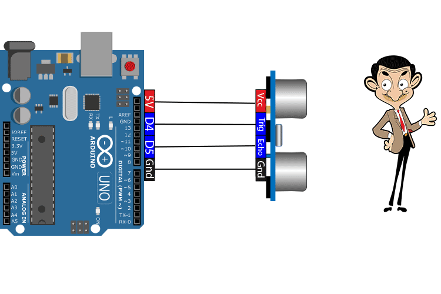

# Proyecto-satelite Grupo 10
Somos Germán, Yassin y Elishka y en este repositorio presentamos nuestro trabajo sobre la implementación de un sistema satelital compuesto por un satélite y una estación de tierra.

## Versión 1:

La Versión 1 del proyecto establece la base del sistema de monitoreo entre el Arduino satélite y la estación de tierra. En esta primera fase se incluyen los componentes esenciales: medir la temperatura y la humedad con un sensor DHT11, enviar estos datos mediante comunicación entre arduinos, y mostrarlos en tiempo real en una interfaz gráfica hecha en Python.
Esta versión también permite controlar el envío de datos, pudiendo detenerlo y reanudarlo, y cuenta con alertas que avisan si hay problemas con el sensor o con la comunicación entre los Arduinos. Además, se hicieron pruebas para comprobar que tanto el sensor como la comunicación funcionen correctamente.
La estructura creada en esta versión servirá como base para añadir funciones más avanzadas en las próximas fases del proyecto.

#### Video:

[Haz click Aquí si quieres ver nuestro video de la versión 1](https://youtu.be/voEOzH-IipM) 

## Versión 2:

En la versión 2 del proyecto se añaden nuevas funciones al sistema de monitoreo. Ahora el satélite puede medir la distancia a objetos cercanos usando un sensor ultrasónico, y se calcula el promedio de los últimos 10 valores de temperatura para generar alertas cuando sea necesario.

#### Video:

[Haz click Aquí si quieres ver nuestro video de la versión 2](https://youtu.be/EIzg0IGf5FU)

## Versión 3:

En la Versión 3 añadimos nuevas funciones al sistema, como el envío de la posición del satélite y la posibilidad de elegir el modo de funcionamiento del sensor de distancia. El usuario también puede cambiar el periodo de envío de cada tipo de dato e introducir observaciones en cualquier momento.
La interfaz gráfica incluye nuevas gráficas dinámicas, entre ellas la representación 2D de la posición, y permite consultar los eventos registrados. Además, el sistema funciona ahora con comunicación inalámbrica y usa checksum para asegurar la integridad de los mensajes.

#### Video:
[Haz click Aquí si quieres ver nuestro video de la versión 3](https://youtu.be/IpSjRsUi1uI)

## Versión 4:

En la Versión 4 añadimos nuevas funciones avanzadas al sistema. Ahora podemos utilizar un mando para desplazarnos por la interfaz gráfica de forma cómoda e intuitiva, lo que permite interactuar con el sistema sin necesidad de teclado o ratón y mejora la experiencia de usuario.

Además, hemos incorporado un sistema de seguridad para proteger el acceso a los datos y a la interfaz gráfica. Se ha diseñado un sistema de inicio de sesión en el que, si el usuario falla tres veces consecutivas al introducir las credenciales, se activa un bloqueo temporal que impide el acceso a la aplicación durante un periodo de tiempo determinado, aumentando así la seguridad del sistema.

Finalmente, hemos añadido una alerta de proximidad que se activa cuando el radar detecta un objeto a menos de 10 cm de distancia. Esta alerta permite reaccionar rápidamente ante posibles riesgos, simulando un sistema de prevención de colisiones similar al que se utiliza en satélites reales.

#### Video:
[Haz click Aquí si quieres ver nuestro video de la versión 4](https://youtu.be/Ag7suqHA7qw)

